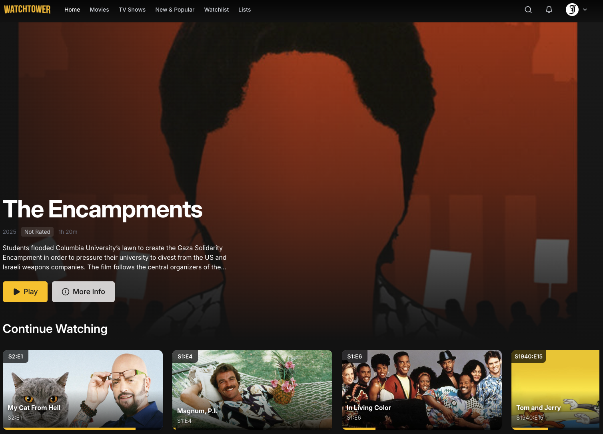
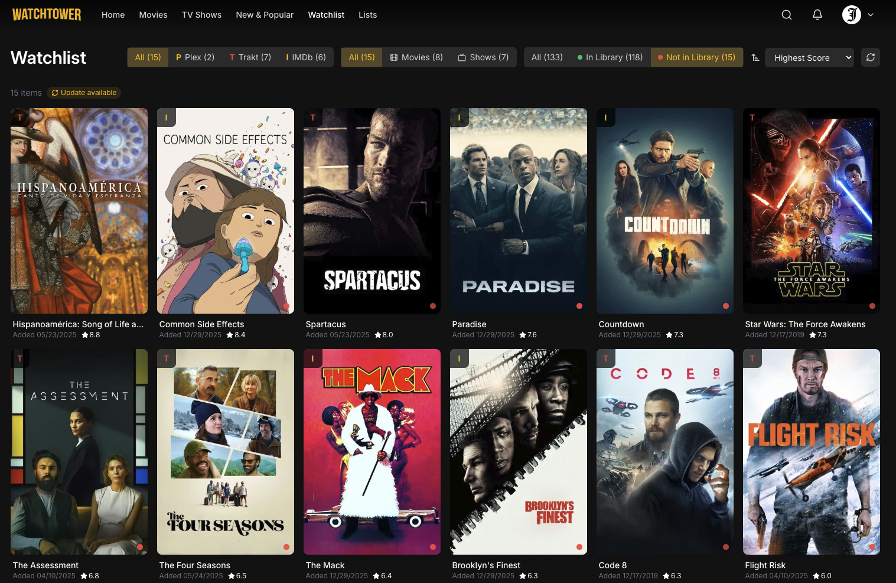

<div align="center">
  

  <h1>Watchtower</h1>

  <p><strong>A modern streaming interface for your Plex library</strong></p>

  <p>
    <a href="https://github.com/jovalle/watchtower/releases"></a>
    <a href="https://github.com/jovalle/watchtower/actions/workflows/ci.yml"></a>
    <a href="https://github.com/jovalle/watchtower/blob/main/LICENSE"></a>
  </p>

  <p>
    
    
    
    
    
  </p>

  <p>
    
    
    
    

  </p>
</div>

---

##  Overview

Watchtower delivers the iconic streaming experience for your personal Plex media library. Hero imagery, smooth animations, clean typography, and pixel-perfect spacing — looks and feels like Netflix but better and with your own content.

Playback progress syncs with Plex across all your devices. TMDB integration surfaces recommendations and rich metadata with graceful fallback when not configured.

It is living proof that you can have a beautiful, user-friendly interface for your media without sacrificing control, privacy, or ownership. Reject the enshittification.

##  Features

- **Netflix-style browsing** — Continue Watching, Recently Added, Trending rows
- **Built-in HLS player** — Quality, audio track and subtitle selection, resume playback, and real-time Plex progress sync
- **Rich metadata** — Cast & crew, IMDb ratings, user ratings, and TMDB recommendations
- **Unified watchlist** — Aggregate watchlists from Plex, Trakt, and IMDB in one view
- **Lists support** — Browse your Plex playlists and collections
- **TV show navigation** — Season/episode browsing with On Deck integration
- **Responsive design** — Optimized for desktop, tablet, and mobile

##  Screenshots

<p align="center">
  
  <br><em>Home — Continue Watching, Recently Added, and personalized rows</em>
</p>

<p align="center">
  
  <br><em>Watchlist — Unified view of Plex, Trakt, and IMDB watchlists</em>
</p>

##  Quick Start

### Docker (Recommended)

```bash
# Clone and configure
git clone https://github.com/jovalle/watchtower.git
cd watchtower
cp .env.example .env

# Edit .env with your Plex credentials
# SESSION_SECRET=<openssl rand -base64 32>
# PLEX_SERVER_URL=http://your-plex-server:32400
# PLEX_TOKEN=<your-plex-token>

# Launch
docker compose up -d
```

Open `http://localhost:9001` and sign in with Plex.

### Local Development

```bash
# Prerequisites: Bun (https://bun.sh)
bun install
bun run dev
```

Open `http://localhost:9001`

##  Environment Variables

| Variable          | Required | Description                                                                                   |
| ----------------- | :------: | --------------------------------------------------------------------------------------------- |
| `SESSION_SECRET`  |    ✓     | Secret for session cookies (`openssl rand -base64 32`)                                        |
| `PLEX_SERVER_URL` |    ✓     | Your Plex server URL (e.g., `http://192.168.1.100:32400`)                                     |
| `PLEX_TOKEN`      |    ✓     | Your Plex authentication token ([how to find](https://support.plex.tv/articles/204059436))    |
| `PLEX_CLIENT_ID`  |          | Client identifier (default: `watchtower-001`)                                                 |
| `PORT`            |          | Server port (default: `9001`)                                                                 |
| `TMDB_API_KEY`    |          | TMDB API key for recommendations and logos ([get free key](https://developer.themoviedb.org)) |
| `TRAKT_CLIENT_ID` |          | Trakt API key to enable Trakt integration (users set their own username in Settings)          |

##  Security Note

> [!NOTE]
> **Plex login may warn about an unfamiliar location**
>
> When signing in, Plex may display a security alert about a login attempt from an unknown IP address or location. This is expected — Watchtower proxies authentication requests through its server, so Plex sees the Watchtower host's IP rather than your device's. You can safely approve the login if you initiated it.

> [!CAUTION]
> **Plex "Networks without auth" setting can bypass authentication for all Watchtower users**
>
> If your Plex server has IP addresses or networks configured in **Settings → Network → List of IP addresses and networks that are allowed without auth** (e.g., `192.168.1.0/24`), be aware that Watchtower proxies requests to Plex on behalf of users. This means Plex sees the requests originating from the Watchtower server's IP address, not the end user's.
>
> If the Watchtower host is within an allowed subnet, **all Watchtower users will inherit auth-free access to your Plex server**, regardless of their own location or authentication status. This could unintentionally expose your library to anyone who can access Watchtower.
>
> **Recommendation:** Review your Plex network settings and avoid including the Watchtower host's subnet in the "allowed without auth" list unless this behavior is intentional.

##  Docker Deployment

```bash
# Build and run manually
docker build -t watchtower .
docker run -d -p 9001:9001 \
  -e SESSION_SECRET="your-secret" \
  -e PLEX_SERVER_URL="http://your-plex:32400" \
  -e PLEX_TOKEN="your-token" \
  --name watchtower watchtower

# Or use Docker Compose
docker compose up -d        # Start
docker compose logs -f      # View logs
docker compose down         # Stop
```

##  Roadmap

Here's what's on the horizon:

### Media Server Support

- **Jellyfin integration** — First-class support for Jellyfin as an alternative to Plex
- **Multi-server** — Connect multiple media servers simultaneously

### Watchlist & Discovery

- **Letterboxd sync** — Import watchlists from the film community's favorite platform
- **Simkl integration** — Sync with Simkl for anime and TV tracking
- **TMDb lists** — Browse and import TMDb curated lists
- **TasteDive recommendations** — "If you liked X, you'll love Y" suggestions

### Enhanced Features

- **Watch party** — Synchronized viewing with friends
- **Offline mode** — Download media for offline playback
- **Smart playlists** — Auto-generated playlists based on mood, genre, or watch history
- **Statistics dashboard** — Viewing habits, most-watched genres, watch time analytics (all private and local)

Have a feature request? [Open an issue](https://github.com/jovalle/watchtower/issues)

##  License

MIT
