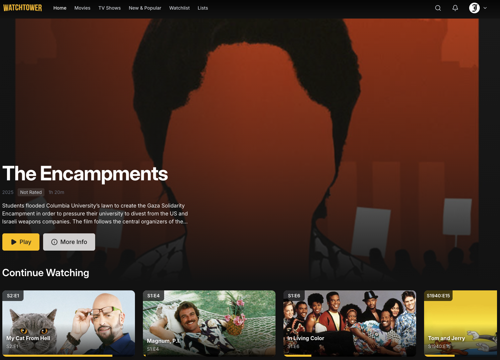
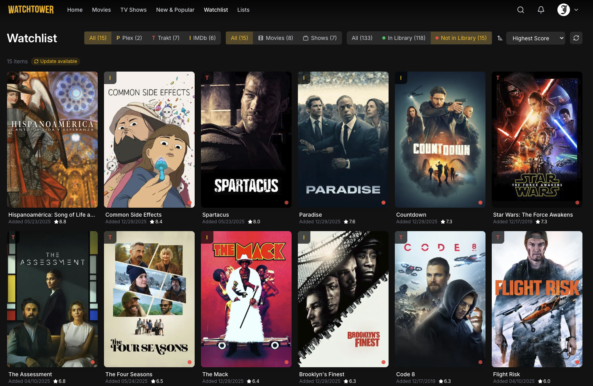

<div align="center">
  

  <h1>Watchtower</h1>

  <p><strong>A modern streaming interface for your Plex library</strong></p>

  <p>
    <a href="https://github.com/jovalle/watchtower/releases"></a>
    <a href="https://github.com/jovalle/watchtower/actions/workflows/ci.yml"></a>
    <a href="https://github.com/jovalle/watchtower/blob/main/LICENSE"></a>
  </p>

  <p>
    
    
    
    
    
  </p>

  <p>
    
    
    
    

  </p>
</div>

---

##  Overview

Watchtower delivers the iconic streaming experience for your personal Plex media library. Hero imagery, smooth animations, clean typography, and pixel-perfect spacing — looks and feels like Netflix but better and with your own content.

Playback progress syncs with Plex across all your devices. TMDB integration surfaces recommendations and rich metadata with graceful fallback when not configured.

It is living proof that you can have a beautiful, user-friendly interface for your media without sacrificing control, privacy, or ownership. Reject the enshittification.

##  Features

- **Netflix-style browsing** — Continue Watching, Recently Added, Trending rows
- **Built-in HLS player** — Quality, audio track and subtitle selection, resume playback, and real-time Plex progress sync
- **Rich metadata** — Cast & crew, IMDb ratings, user ratings, and TMDB recommendations
- **Unified watchlist** — Aggregate watchlists from Plex, Trakt, and IMDB in one view
- **Lists support** — Browse your Plex playlists and collections
- **TV show navigation** — Season/episode browsing with On Deck integration
- **Responsive design** — Optimized for desktop, tablet, and mobile

## Navigation and playback

The logo opens Home. **Watch** contains Movies, Series, and New in library. **Discover** opens external discovery; disabling discovery in Settings hides that section and prevents its feeds from loading. **My Stuff** contains Watchlist and Lists. Old bookmarks redirect with their query parameters. Requests, Issues, and Settings remain in the profile menu.

Home separates in-progress titles from next unwatched episodes and labels related library recommendations with the title that prompted them. Playback reports progress to Plex. Settings includes **Autoplay next episode**, enabled by default; the countdown can also be cancelled in the player. Stream information distinguishes requested quality, source-file metadata, and delivered video dimensions when the browser reports them.

Title pages use media type and provider IDs to resolve accessible library matches. **Requests & availability** shows regular/4K and season status from Seerr. Partial series can request remaining seasons through Seerr's permissions and quota checks. Availability in Seerr alone does not grant access to a Plex library.

## Request notifications

Configure Seerr in Settings and import the corresponding Plex users into Seerr. The header checks for request updates once per minute while the page is visible. Opening Notifications also checks for updates, subject to the same one-minute minimum. No background scheduler or external email/push service is required.

The first successful check establishes the existing request state without sending old updates. Later observed transitions produce unread notifications linking to the title page. Updates that occur entirely between polls cannot be reconstructed. Read state and deduplication history survive restarts in `DATA_PATH/notifications`, scoped to the Plex user and configured Seerr URL. Keep the data volume persistent and backed up.

Polling covers the most recent 200 requests and retains the newest 200 notifications. The inbox reports when older requests fall outside that window. When the listing is complete, each poll also checks up to 20 previously observed missing requests; only a confirmed 404 is treated as cancelled/deleted. An outage preserves existing notifications and displays a refresh error.

Run one Watchtower process against a data directory. Notification writes use an in-process lock and atomic replacement; multiple writers require shared transactional storage. Playback session ownership also lives in the app process. After an app restart, reload an active player to establish a new session. No existing config or watch history migration is needed; the autoplay setting has an additive default. Rolling back the application can leave the new notification files in place.

## Casting and validation status

The player exposes browser-native AirPlay/Remote Playback only when the browser reports a receiver for a native media source. HLS played through Media Source Extensions does not use this path. Stream URLs remain authenticated; receivers must support the browser's authenticated playback handoff. There is no custom Chromecast receiver or public token-bearing stream URL.

**Receiver playback is not yet verified.** Desktop/mobile playback compatibility, audible track selection, cross-device resume, and the full keyboard/remote journey also require live acceptance. See the [delivery ledger](docs/netflix-replacement-plan.md#delivery-ledger) and [continuation handoff](docs/implementation-handoff.md) for evidence and remaining work. A visible casting control is not a compatibility guarantee.

##  Screenshots

<p align="center">
  
  <br><em>Home — Continue Watching, Recently Added, and personalized rows</em>
</p>

<p align="center">
  
  <br><em>Watchlist — Unified view of Plex, Trakt, and IMDB watchlists</em>
</p>

##  Quick Start

### Docker (Recommended)

```bash
# Clone and launch
git clone https://github.com/jovalle/watchtower.git
cd watchtower
docker compose up -d

# Get the one-time setup code
docker compose logs watchtower | grep -A2 'setup code'
```

Open `http://localhost:9001`, sign in with the Plex account that owns your server, enter the setup code, and pick a server connection. Watchtower saves the server and its token under `./data/config`, so setup survives restarts. Other users see a "not set up yet" notice until you finish. You can change the server later from **Settings → Server Administration**.

### Local Development

```bash
# Prerequisites: Node.js 22+, Bun (https://bun.sh), and just (https://just.systems)
bun install --frozen-lockfile
just dev
```

Open `http://127.0.0.1:9001`. On first setup, follow the setup code printed in the terminal. `just dev` runs Remix/Vite with live reload for UI and server-route edits; it does not require a production build. Keep the same hostname and port while signing in through Plex.

Use `just dev 9021` if port 9001 is occupied. For testing on another device on your network, explicitly bind all interfaces with `just dev 9021 0.0.0.0` and open your computer's LAN address on that device. Development uses your configured services and local data; requests and playback actions affect those services.

Run `just check` for lint, TypeScript, and tests, or `just test` for tests alone. `just build` followed by `just start` evaluates a production build without live reload. Run `just` to list recipes. Without just, the equivalent dev command is `bun run dev --host 127.0.0.1 --port 9001 --strictPort`.

##  Environment Variables

All optional. The Plex server and token are configured at `/setup`, not through the environment.

| Variable          | Description                                                                                   |
| ----------------- | --------------------------------------------------------------------------------------------- |
| `SESSION_SECRET`  | Secret for session cookies. Default: generated and saved to `DATA_PATH/config/session-secret` |
| `DATA_PATH`       | Data directory for config and caches (default: `/data` in production, `./data` otherwise)     |
| `PLEX_CLIENT_ID`  | Client identifier (default: `watchtower-001`)                                                 |
| `PORT`            | Server port (default: `9001`)                                                                 |
| `SECURE_COOKIES`  | Set to `true` behind HTTPS                                                                    |
| `TMDB_API_KEY`    | TMDB API key for recommendations and logos ([get free key](https://developer.themoviedb.org)) |

Trakt is enabled only by a saved client ID and secret in Settings → Integrations. A legacy `TRAKT_CLIENT_ID` environment value no longer enables requests; move existing credentials into Integrations to keep using Trakt. Users also need a watchlist username for list imports.

##  Security Note

> [!NOTE] > **Plex login may warn about an unfamiliar location**
>
> When signing in, Plex may display a security alert about a login attempt from an unknown IP address or location. This is expected — Watchtower proxies authentication requests through its server, so Plex sees the Watchtower host's IP rather than your device's. You can safely approve the login if you initiated it.

> [!CAUTION] > **Plex "Networks without auth" setting can bypass authentication for all Watchtower users**
>
> If your Plex server has IP addresses or networks configured in **Settings → Network → List of IP addresses and networks that are allowed without auth** (e.g., `192.168.1.0/24`), be aware that Watchtower proxies requests to Plex on behalf of users. This means Plex sees the requests originating from the Watchtower server's IP address, not the end user's.
>
> If the Watchtower host is within an allowed subnet, **all Watchtower users will inherit auth-free access to your Plex server**, regardless of their own location or authentication status. This could unintentionally expose your library to anyone who can access Watchtower.
>
> **Recommendation:** Review your Plex network settings and avoid including the Watchtower host's subnet in the "allowed without auth" list unless this behavior is intentional.

##  Docker Deployment

```bash
# Build and run manually
docker build -t watchtower .
docker run -d -p 9001:9001 -v "$PWD/data:/data" \
  --name watchtower watchtower

# Or use Docker Compose
docker compose up -d        # Start
docker compose logs -f      # View logs
docker compose down         # Stop
```

##  Roadmap

Here's what's on the horizon:

### Media Server Support

- [ ] **Jellyfin integration** — First-class support for Jellyfin as an alternative to Plex
- [ ] **Multi-server** — Connect multiple media servers simultaneously

### Watchlist & Discovery

- [ ] **Letterboxd sync** — Import watchlists from the film community's favorite platform
- [ ] **Simkl integration** — Sync with Simkl for anime and TV tracking
- [ ] **TMDb lists** — Browse and import TMDb curated lists
- [ ] **TasteDive recommendations** — "If you liked X, you'll love Y" suggestions

### Enhanced Features

- [ ] **Watch party** — Synchronized viewing with friends
- [ ] **Offline mode** — Download media for offline playback
- [ ] **Smart playlists** — Auto-generated playlists based on mood, genre, or watch history
- [ ] **Statistics dashboard** — Viewing habits, most-watched genres, watch time analytics (all private and local)

Have a feature request? [Open an issue](https://github.com/jovalle/watchtower/issues)

##  License

MIT
